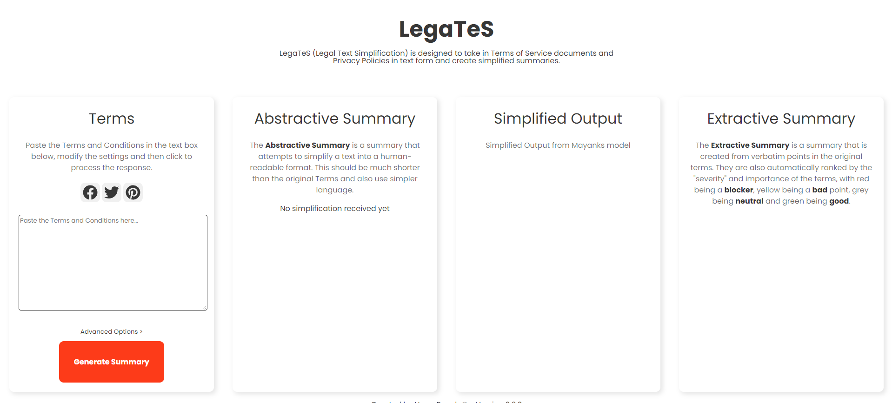
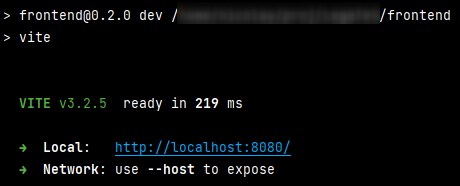
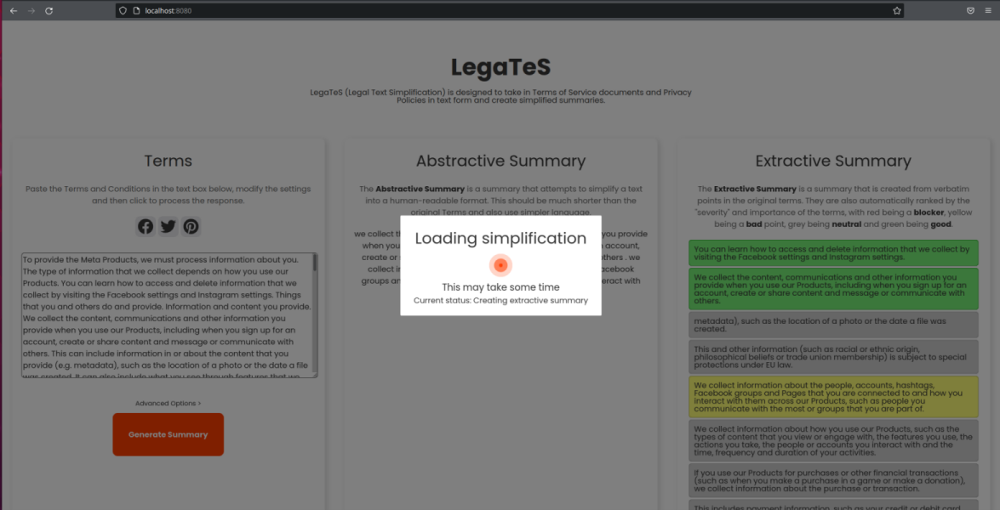

# LegaTeS


LegaTeS represents a hybrid text summarization system aimed on extraction of the salient information from legal documents.
This is the frontend and backend implementation of the related system. 
The repository consists of a web interface created with [Svelte](https://github.com/sveltejs/svelte), 
and a FastAPI/PyTorch/TensorFlow backend.



## Setup and Requirements
This project is tested under `Python-3.9`.
To run the project, both the backend and the frontend must be runing concurrently. The models that are required are included within the backend directory.

### Starting the backend

To start the backend, it is recommended to use [Poetry](https://python-poetry.org/docs/basic-usage/), which is a python dependency manager.

First, navigate into the backend:
```bash
cd backend
```

and run the following command to install all of the required dependencies:

```bash
poetry install
```

Then, to start the service, run the following:

```bash
poetry run start
```

When the models are called for the first time, they must be downloaded. They will be cached from this point onwards, making subsequent calls much quicker.

### Starting the backend (alternative)

To start the backend without having to install Poetry, a requirements.txt file is also provided. You can install the dependencies from it like so:


```bash
pip install -r requirements.txt
```

Then you can start the module directly:

```bash
python -m backend
```

### Starting the frontend

For the frontend, there is a need to [install](https://nodejs.org/en/download/) `pnpm` first (or equivalent such as `npm` or `yarn`).

```bash
cd ./frontend
```

Then, you must install the dependencies:

```bash
pnpm i
```

and start the frontend:

```bash
pnpm run dev
```


## Usage

Once both components are running, you can visit the page from the URL that is provided by the frontend application.



## Evaluation

All the resources related to evaluation are shared in `data` [folder](data/).

We consider a manually composed `ToS;DR5` [dataset](data/tos-dr-5.7z) for assessment of the related text summarization system components.

