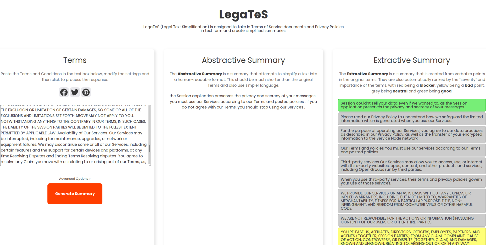

# Simplifying Legal Content


This is the frontend and backend code for my dissertation on simplifying legal content. The repository consists of a web interface created with Svelte, and a FastAPI/PyTorch/TensorFlow backend.



## Setup and Requirements


This project is tested under `Python-3.9`.
For the `backend`, we consider the following dependencies.

```bash
pip install -r dependencies.txt
```

The models required are included within the backend directories, and use the appropriate format for an exported model.

## Usage

To run the project, both the frontend and backend must be running concurrently. 

1. **Backend:** To start the backend, navigate into the backend directory and run the command:
```poetry run start```

2. **Frontend:** To start the frontend, navigate into the frontend direction and run the command:
```pnpm run dev```
